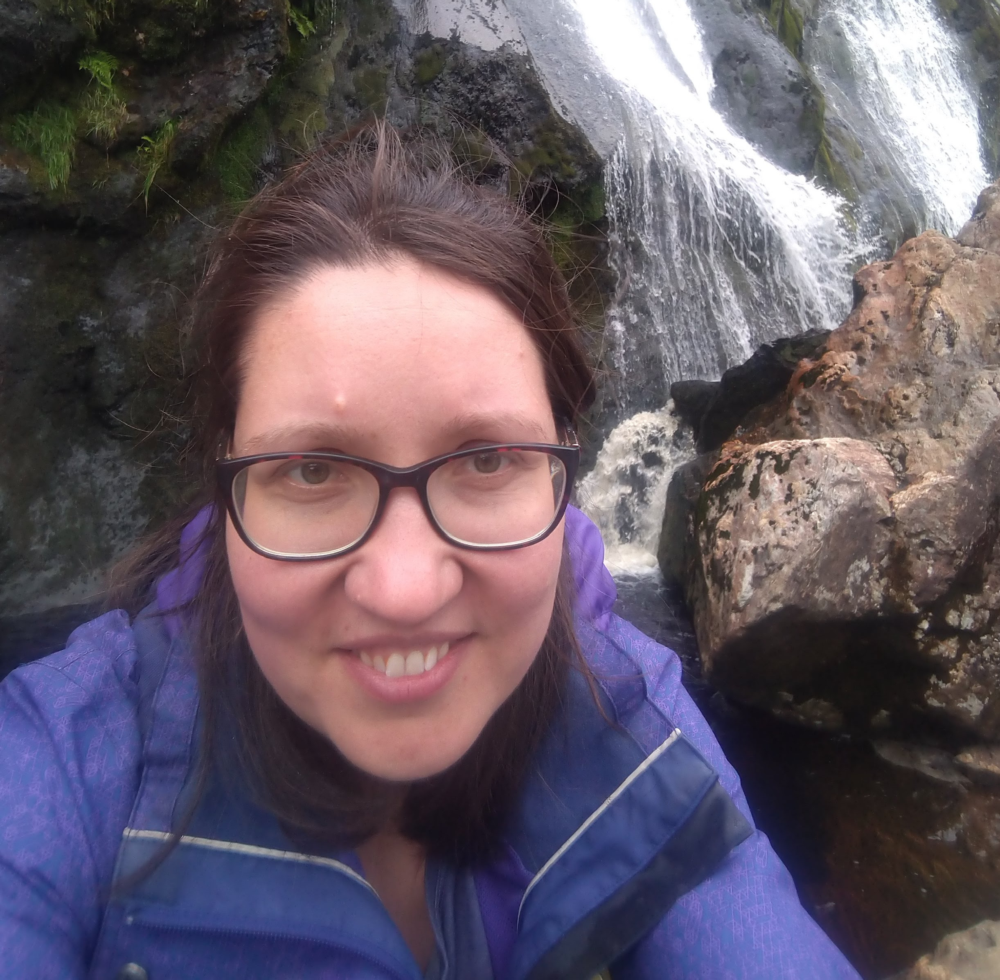

<h1> </h1>

My name is Anna Ershova. I got my PhD in bioinformatics in 2016 at Lomonosov Moscow State University (Russia).
I am interested in using bioinformatics and wet-lab methods to identify and solve biologically meaningful problems. I have published 15 research articles.
In 2020, I got a Marie Skłodowska Curie Individual Fellowship to study epigenetic regulation in <i>Acinetobacter baumannii</i> and
joined Dr. Carsten Kröger's Lab in the Department of Microbiology, School of Genetics and Microbiology, Trinity College Dublin.
It was absolutely fantastic two-years journey, with many ups and downs, meeting new eukaryotic and prokaryotic friends.
I will try to share not just project's results, which are more convenient for the publication in special journals, but my experience of being a researcher.  

